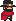

 **Marston** **最简单上手**角色。

- 优点在于**攻速快**。缺点在于**击飞力度小**。
- 建议低百分比时尽量找机会**近身攻击**，控住对手的同时逼对手交 Break。
- 高百分比时龟一点，用手枪打远程，不建议在对手有 Break 的情况下近身攻击。用 Break 来弥补击飞力度小的缺陷。

 

 **Namka** **上手难度较高**。

- 优点在于**近战伤害和击飞力度都大**，远程射击可以给对手造成**硬直**。
- 缺点在于**近战前摇和后摇都很大**，**重量较低**，很容易在低百分比时被击飞。
- **近身攻击很难打中人**，故建议对手百分比低时用枪边攻击边龟着，在怒气值高的情况下，**可消耗 15 怒气取消近战后摇**弥补缺陷。

 

 **Musashi** **最难上手的角色**。

- 优点在于技能丰富，**蓄力斩蓄满的击飞力度**特别大，有**防反**技能，有**闪避**技能，且在敌人攻击的时候刚好**闪避成功回复怒气值**。
- 缺点是**进攻手段较少**，蓄力会被打断，且**蓄力斩本身伤害较低**。
- 建议是前期**利用闪避多攒怒气**，但小心不要冲出场了，怒气值上来了可以开防御来反击对手近身攻击或反弹对手子弹，对手百分比上来了可直接使用 Break 击飞。
- 也可以**蓄满蓄力斩碰运气**，能摸到对手那对手直接没了。
